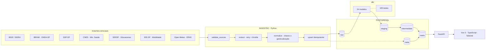
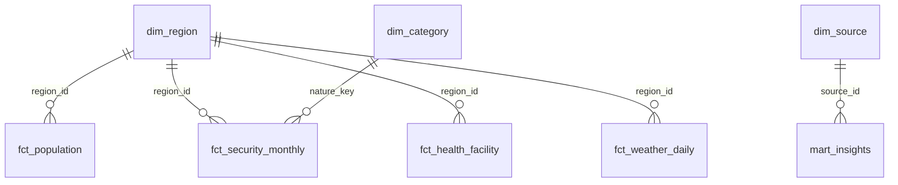

# DF Intelligence

**Brasília através dos dados.**

Plataforma de inteligência urbana sobre o Distrito Federal: uma camada analítica
que consolida dados públicos de população, segurança, saúde e clima nas 35
Regiões Administrativas — com ingestão automatizada, modelagem dimensional,
testes de qualidade, API e interface.

```
35 Regiões Administrativas  ·  6 domínios  ·  10 fontes catalogadas
70.035 ocorrências criminais (2014–2026)  ·  98.630 dias de clima
2.460 estabelecimentos de saúde  ·  105 testes de qualidade
```

---

## O problema

Dados públicos do DF existem, mas não formam um conjunto utilizável.

**Estão dispersos.** População no IBGE, crimes na SSP-DF, saúde no Ministério da
Saúde, limites territoriais no IBRAM. Cada um com uma nomenclatura de região
diferente.

**Estão em formatos hostis.** A SSP-DF publica 331 planilhas Excel numa página
HTML, com links opacos que se repetem entre anos. O Portal de Dados Abertos do
DF migrou de CKAN para uma SPA e **matou a API** que praticamente toda a
documentação na internet ainda cita — `dados.df.gov.br/api/3/action/*` hoje
responde 404.

**Têm armadilhas que produzem conclusões falsas.** O exemplo mais claro:
comparar a população de Ceilândia entre os Censos de 2010 e 2022 sugere uma
queda de 28,7%. Ninguém foi embora — o Sol Nascente/Pôr do Sol, com 101.866
habitantes, foi separado dela. Um dashboard ingênuo publicaria essa queda como
fato.

## A solução

Um pipeline que trata as fontes públicas como elas são — instáveis, incompletas
e cheias de ciladas — e entrega uma camada analítica com três compromissos:

1. **Nada é inventado.** Todo número vem de uma fonte oficial testada. Onde a
   fonte não publica, o valor é `NULL` e a interface mostra `—`.
2. **A lacuna é parte do produto.** Cobertura irregular não é escondida: é
   medida, publicada e visível no mapa, nos gráficos e numa página própria.
3. **Métrica que não pode ser calculada não é publicada.** O crescimento
   populacional por RA **não existe** neste produto, e a explicação de por quê é
   um dos insights.

---

## Arquitetura



Detalhes e decisões técnicas em [`docs/architecture.md`](docs/architecture.md).

---

## Fontes

Todas foram acessadas e inspecionadas de fato. Tabela completa, com campos,
cobertura e limitações, em [`docs/data_sources.md`](docs/data_sources.md).

| Domínio | Fonte | Acesso | Granularidade | Período |
|---|---|---|---|---|
| Regiões | IBRAM / ONDA-DF (GDF) | API ArcGIS REST | 35 RAs, com geometria | 2025 |
| Regiões | IBGE — Localidades | API REST | Subdistrito = RA | malha 2022 |
| População | IBGE / SIDRA (9923, 1309) | API REST | Região Administrativa | Censos 2010 e 2022 |
| População | IBGE / SIDRA (6579) | API REST | Distrito Federal | 2001–2026 |
| Segurança | SSP-DF — Balanço Criminal | HTML + 331 planilhas | RA × mês × natureza | 2014–2026 |
| Saúde | CNES / Ministério da Saúde | API REST | Estabelecimento → RA | posição atual |
| Educação | SEEDF / Inep — Educacenso | API CKAN + 24 CSVs | Escola → RA × ano | 2014–2025 |
| Mobilidade | IDE-DF / SEDUH | API ArcGIS REST | Trecho e estação → RA | posição atual |
| Clima | Open-Meteo / ERA5 | API REST | Célula de grade × dia | 2019–hoje |

**Rejeitadas, com o motivo registrado:** Portal de Dados Abertos do DF (perdeu a
API), InfoSaúde/SES-DF (painéis BI, agregação por Região de Saúde), INMET
(estações concentradas demais para 35 RAs), microdados do Inep (cadeia TLS
incompleta, sem RA), SEMOB e DETRAN (não respondem fora do Brasil), Kaggle e agregadores não oficiais.

> **Ressalva obrigatória:** o clima vem do Open-Meteo/ERA5 — fonte **externa e
> não governamental**. São valores de modelo de reanálise interpolados, não
> leitura de estação do INMET.

---

## O que o pipeline faz

```bash
./scripts/run_pipeline.sh
```

1. **Valida as fontes** — requisição real a cada uma; falha cedo se o contrato
   mudou.
2. **Ingere** — `regions` primeiro (cria as chaves), depois `population`,
   `security`, `health`, `weather`. Idempotente: rodar de novo atualiza, não
   duplica.
3. **Transforma com dbt** — `staging` → `intermediate` → `marts`.
4. **Testa** — 105 verificações. Falha interrompe o build.
5. **Confere** — conta as linhas de cada mart e imprime o estado de cada fonte.

### Três decisões que sustentam a confiabilidade

**O significado vem do conteúdo, não do invólucro.** O ano de uma planilha da
SSP-DF é lido da célula do cabeçalho, nunca do link — porque os links do portal
se repetem entre anos. Link trocado vira download redundante, não dado errado.

**Anomalia é detectada nos dados, não listada à mão.** Coordenadas
compartilhadas por 20 ou mais estabelecimentos do CNES são identificadas por
contagem e tratadas como ausentes. Sem isso, 274 registros se empilhavam na RA
onde a coordenada falsa cai.

**Inferência só preenche quando a evidência é forte.** Estabelecimentos sem
coordenada herdam a RA do seu bairro apenas se houver ao menos 3 vizinhos
geolocalizados e 80% de concordância. Os 151 que não passam ficam sem região —
não são distribuídos entre as demais.

---

## Modelo de dados



| Tabela | Grão | Linhas |
|---|---|---|
| `dim_region` | Região Administrativa | 35 |
| `fct_population` | região × ano censitário | 52 |
| `fct_population_df` | ano | 22 |
| `fct_security_monthly` | região × mês × natureza | 70.035 |
| `fct_health_facility` | estabelecimento | 2.460 |
| `fct_weather_daily` | região × dia | 98.630 |
| `mart_insights` | achado calculado | 10 |

Dicionário completo em [`docs/data_dictionary.md`](docs/data_dictionary.md).
A chave de tudo é `region_id` — o código romano da RA (`RA-I` … `RA-XXXV`),
único identificador estável entre as fontes. A normalização de nomes está em
[`docs/region_mapping.md`](docs/region_mapping.md).

---

## Qualidade dos dados

105 testes dbt + 40 testes pytest. Documentação completa em
[`docs/data_quality.md`](docs/data_quality.md).

**O teste mais valioso:** a soma da população das RAs tem que bater exatamente
com o total oficial do IBGE (2010: 2.570.160; 2022: 2.817.381). Ele valida de
uma vez o mapeamento RA↔subdistrito, a ingestão e a ausência de duplicata.

**Problemas reais encontrados e corrigidos durante a construção:**

| Problema | Impacto se ignorado |
|---|---|
| Coordenada de preenchimento do CNES (274 registros em 2 pontos) | Cruzeiro aparecia com 99,1 estabelecimentos por 10 mil hab. Após a correção: 9,7. |
| Esfera administrativa usada como setor | 98% da rede seria classificada como pública. É 95% privada. |
| Célula `12.0` lida como `120` no parser da SSP | Ocorrências 10× maiores. Encontrado por teste antes de afetar o banco. |
| Comparação 2014 × 2026 na série de segurança | Insight de −85% comparando 29 RAs/12 meses com 31 RAs/8 meses. |
| Fronteiras mudaram entre os Censos | "Ceilândia perdeu 29% da população" — publicado como fato. |
| Códigos de RA 34/35 invertidos na SEEDF (e nome trocado em 2025) | Escolas do Arapoanga contadas em Água Quente. RA passou a vir da coordenada. |
| Arquivos de matrículas omitem escolas ativas em 8 de 12 anos (2023: 600 de 1.264) | "Queda de 4% de 2014 para 2015" — 94% dela são escolas ausentes do arquivo. Completude medida por ano × rede; esses anos viram lacuna. |
| Camada de estações repete 17 estações de metrô e omite a Rodoviária do Plano Piloto | Metrô contado duas vezes e "0 terminais" no Plano Piloto. Só a camada de metrô entra; terminais não são publicados. |
| Ensino médio reclassificado como integrado em 2025 | "Ensino médio perdeu 11% dos alunos". Série publicada como médio + integrado. |

**Limitações declaradas na API e na interface:** dados de segurança são
registros policiais (não o crime, mas o **registro** do crime); taxas usam
população residente, o que infla regiões com muito fluxo diário; o CNES mede
infraestrutura instalada, não atendimentos realizados; clima é reanálise, não
medição.

---

## Métricas e análises

**População** — total do DF (série anual), por RA (Censos), densidade.
**Segurança** — ocorrências por RA, mês e natureza; CVLI; taxa por 10 mil
habitantes; produtividade policial contada **à parte**, porque ela mede atuação
da polícia, não violência da região.
**Saúde** — rede instalada por RA, por tipo e setor; estabelecimentos por 10 mil
habitantes.
**Clima** — temperatura, precipitação, dias de chuva, sazonalidade.

Os insights são calculados, não redigidos: cada um carrega período, metodologia,
fonte e ressalva. Exemplos gerados pelo pipeline:

> Nas 29 Regiões Administrativas com série completa em ambos os anos, os crimes
> registrados passaram de 64.417 em 2014 para 19.485 em 2025 — variação de
> −69,8%.

> Normalizando pela população, Plano Piloto registrou 207,5 crimes por 10 mil
> habitantes em 2025, enquanto Jardim Botânico registrou 6,3 — uma diferença de
> 32,9 vezes.

> Nenhuma das 35 Regiões Administrativas permite comparar diretamente os Censos
> de 2010 e 2022: das 19 que existiam em 2010, todas cederam território às 16
> criadas no período.

> A SSP-DF não publica o balanço criminal de 2024 para 15 das 35 Regiões
> Administrativas.

**Nenhum insight afirma causa.** Há um teste automatizado
(`test_insights_never_claim_causation`) que varre os textos procurando "causou",
"provocou", "por causa de" e "resultou em". Correlação não implica causalidade.

---

## Interface

Três páginas, dark mode, responsivo:

- **Dashboard** — KPIs, mapa das 35 RAs com seis métricas selecionáveis,
  ranking interativo, séries temporais de população, crimes, temperatura e
  chuva.
- **Região** — página por RA, com população nos dois Censos, série mensal de
  ocorrências, rede de saúde detalhada e clima.
- **Insights** e **Fontes & Qualidade** — achados com metodologia, catálogo de
  fontes, cobertura por região e estado do pipeline.

O mapa é SVG renderizado do GeoJSON servido pela API — sem biblioteca de mapas.
Regiões sem dado para a métrica escolhida aparecem **hachuradas**, e séries com
lacuna têm a linha **interrompida**. Em nenhum lugar ausência vira zero.

---

## Instalação

**Requisitos:** Docker e Docker Compose. Para desenvolvimento fora do container,
Python 3.12+ e Node 22+.

```bash
git clone <url-do-repositorio>
cd df-intelligence
cp .env.example .env
```

### Execução

```bash
# 1. Sobe Postgres, API e frontend
docker compose up -d

# 2. Popula o banco (ingestão + dbt). ~12 min na primeira vez.
docker compose run --rm pipeline
```

Pronto:

| | |
|---|---|
| **DF Intelligence** | http://localhost:5173 |
| **API (Swagger)** | http://localhost:8000/docs |
| **API (ReDoc)** | http://localhost:8000/redoc |
| **PostgreSQL** | `localhost:55432` |

### Desenvolvimento local

```bash
./scripts/setup.sh          # .env, venv, npm install, Postgres
./scripts/run_pipeline.sh   # ingestão + dbt + testes

# API com reload
uvicorn api.main:app --reload

# Frontend com HMR (proxy de /api para a API)
cd frontend && npm run dev
```

### Atualização dos dados

```bash
./scripts/run_pipeline.sh                  # tudo
./scripts/run_pipeline.sh --only security  # uma fonte
./scripts/run_pipeline.sh --skip-ingestion # só remodelar
```

Tudo é idempotente. O clima é incremental (retoma do último dia gravado); as
demais fontes fazem *upsert* sobre chave natural.

No GitHub Actions, o pipeline completo roda **todo dia 5** — a SSP-DF e o CNES
publicam mensalmente. Testes unitários e validação de fontes rodam em todo push.
Nenhum segredo é necessário: todas as fontes são públicas.

### Testes

```bash
pytest                    # 40 testes (integração é pulada sem banco)
cd dbt && dbt build       # 24 modelos + 105 testes de qualidade
cd frontend && npm run typecheck
```

---

## Estrutura

```
df-intelligence/
├── ingestion/          # extração e carga por fonte
│   ├── common.py       # HTTP educado, upsert idempotente, registro de execução
│   ├── regions.py      # malha das RAs + subdistritos IBGE
│   ├── population.py   # Censos 2010/2022 + série anual do DF
│   ├── security.py     # 331 planilhas da SSP-DF
│   ├── health.py       # CNES + join espacial
│   ├── education.py    # Educacenso (SEEDF): 24 CSVs, RA pela coordenada
│   ├── mobility.py     # IDE-DF: ciclovias recortadas por RA e metrô
│   ├── weather.py      # Open-Meteo, incremental
│   └── validate_sources.py
├── db/init/            # DDL dos schemas raw e meta
├── dbt/
│   ├── models/         # staging → intermediate → marts
│   ├── seeds/          # mapeamentos versionados
│   ├── tests/          # testes singulares de qualidade
│   └── macros/
├── api/                # FastAPI
├── frontend/           # Vue 3 + TypeScript + Tailwind
├── tests/              # pytest
├── scripts/            # setup.sh, run_pipeline.sh
├── docs/
│   ├── architecture.md
│   ├── data_sources.md
│   ├── data_dictionary.md
│   ├── data_quality.md
│   └── region_mapping.md
└── .github/workflows/
```

---

## API

20 endpoints, documentação automática em `/docs`.

```
GET /api/overview                        KPIs do dashboard
GET /api/regions                         as 35 RAs
GET /api/regions/geojson                 malha + indicadores (alimenta o mapa)
GET /api/regions/{id}                    detalhe de uma RA
GET /api/regions/{id}/indicators         todos os indicadores da RA
GET /api/indicators                      indicadores de todas as RAs
GET /api/indicators/catalog              o que cada indicador mede
GET /api/population?scope=region|df      Censos por RA ou série do DF
GET /api/security                        série mensal por RA e natureza
GET /api/security/summary                série agregada (DF ou uma RA)
GET /api/health                          rede instalada por RA
GET /api/health/facilities               estabelecimentos individuais
GET /api/weather                         série climática mensal por RA
GET /api/weather/summary                 média do DF
GET /api/insights                        achados calculados
GET /api/sources                         catálogo de fontes
GET /api/coverage                        o que existe e o que falta
GET /api/pipeline                        estado da última ingestão
```

```bash
curl -s localhost:8000/api/regions/RA-IX/indicators | jq
curl -s "localhost:8000/api/security?region_id=RA-IX&category_code=CVLI&year_from=2024" | jq
curl -s localhost:8000/api/coverage | jq '.[] | select(.security_missing_years | length > 0)'
```

---

## Limitações

Estas são propriedades das fontes, não do pipeline. Estão declaradas na API
(campo `caveat`) e na interface.

- **Não existe série anual de população por RA.** Só os Censos de 2010 e 2022.
  Bases federais de saúde e economia param no município `5300108` — o DF
  inteiro.
- **Não há crescimento populacional por RA.** Todas as 19 RAs de 2010 cederam
  território às 16 criadas depois.
- **Dados de segurança são registros policiais.** Medem o registro, não o
  crime. Subnotificação varia entre regiões e naturezas.
- **Taxas usam população residente.** Regiões com muito fluxo diário de não
  residentes têm taxa inflada.
- **O denominador é sempre o Censo 2022.** Taxas de anos distantes carregam
  esse denominador; `population_reference_year` acompanha o número.
- **O CNES mede infraestrutura, não produção.** E 151 estabelecimentos ficam
  sem região determinada.
- **O clima não é fonte governamental do DF** e tem resolução mais grossa que
  uma RA.
- **A SSP-DF não publica 2024 para 15 RAs.**
- **Matrícula é contada onde a escola fica,** não onde o aluno mora. Por isso
  não há taxa de matrícula por habitante. Só 2014, 2021, 2024 e 2025 têm arquivo
  de matrículas completo; 2024 não publica total.

---

## Próximos passos

- Acidentes de trânsito por RA (DETRAN-DF), quando houver execução a partir do Brasil.
- Acessibilidade ao metrô: população a até 1 km de estação, com a população por setor censitário da IDE-DF.
- Resultados de aprendizagem por escola (SAEB/IDEB, também publicados pela SEEDF).
- Produção de atendimentos em saúde, se o GDF publicar API para o novo portal.
- Validação cruzada do clima com a estação do INMET em Brasília.
- Séries intercensitárias por RA a partir das projeções do IPEDF/Codeplan.

---

## Licença

Código sob [MIT](LICENSE). Os dados pertencem às fontes originais e seguem as
licenças delas — cite a fonte ao reutilizar números.

Projeto independente, sem vínculo com o Governo do Distrito Federal.
