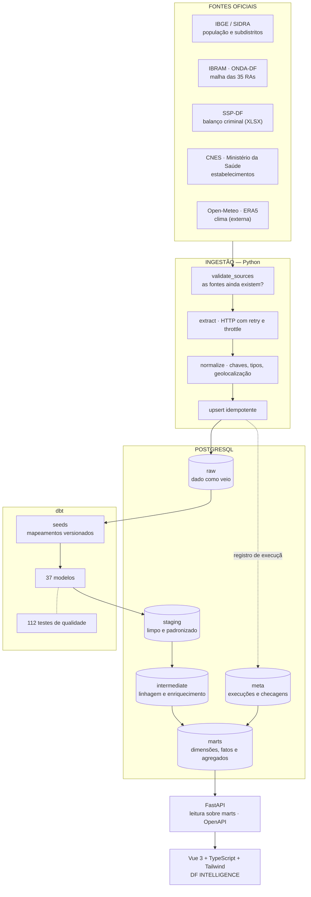
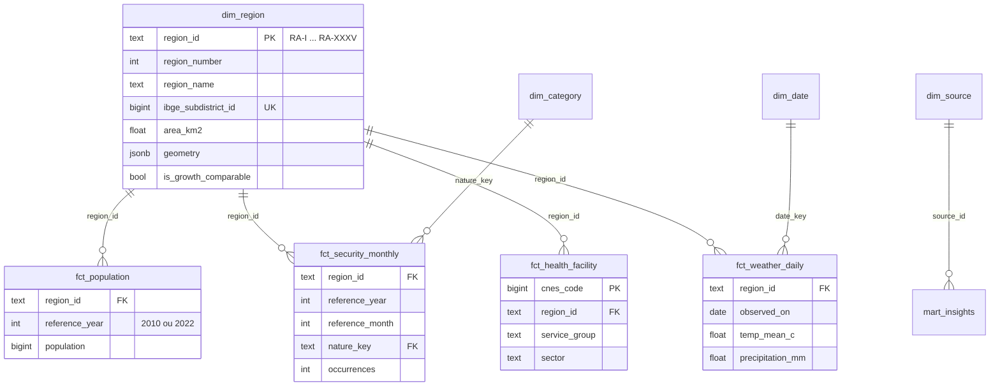

# Arquitetura

## 1. Visão geral



## 2. Princípios que guiaram as decisões

### 2.1 A fonte manda, o pipeline se adapta

Nenhuma fonte pública do DF oferece contrato estável. O portal de dados abertos
trocou de CKAN para SPA e matou a API que a internet inteira ainda documenta; a
SSP-DF publica planilhas com *slugs* que se repetem entre anos; o CNES preenche
coordenada com o centro de Brasília quando não sabe o endereço.

A resposta do projeto é sempre a mesma: **derivar o significado do conteúdo, não
do invólucro.** O ano de uma planilha da SSP sai da célula do cabeçalho, não do
link. Uma coordenada compartilhada por 232 estabelecimentos é detectada por
contagem, não por lista fixa. O tipo de unidade de saúde vem da própria tabela
de domínio da API, não de códigos digitados à mão.

### 2.2 Lacuna é dado

Cobertura irregular é a norma nessas fontes. Duas regras derivam disso:

* **Ausência nunca vira zero.** `NULL` atravessa o pipeline inteiro e chega ao
  frontend como `—` ou como hachura no mapa.
* **A cobertura é um produto.** `marts.mart_data_coverage` e a página
  *Fontes & Qualidade* existem para mostrar o que falta, não para esconder.

### 2.3 Métrica que não pode ser calculada não é publicada

O caso canônico é o crescimento populacional por RA. Das 35 RAs atuais, 19
existiam no Censo 2010; as outras foram desmembradas. Comparar os dois Censos
sem tratar isso diria que Ceilândia perdeu 29% da população — quando na verdade
o Sol Nascente/Pôr do Sol foi separado dela.

O projeto prefere não publicar a métrica a publicar uma errada:
`dim_region.is_growth_comparable` é falso para essas RAs e o campo de variação
volta `NULL`. Há um teste automatizado que falha se alguma RA não comparável
publicar variação.

### 2.4 Separação rígida de responsabilidades

| Camada | Faz | Não faz |
|---|---|---|
| Ingestão | acessar fonte, validar resposta, normalizar chave, geolocalizar, gravar RAW | calcular indicador |
| dbt | limpar, padronizar, juntar, agregar, testar | acessar rede |
| API | ler `marts` e adicionar metadados de leitura | calcular indicador |
| Frontend | apresentar e declarar ressalvas | calcular indicador |

Se um número está errado, existe exatamente um lugar para corrigir: o modelo
dbt que o produz.

## 3. Camadas do banco

| Schema | Materialização | Conteúdo |
|---|---|---|
| `raw` | tabelas (ingestão Python) | uma tabela por recurso de fonte, com `_source_url` e `_ingested_at` em todas |
| `staging` | views (dbt) | tipagem, nomes canônicos, normalização de RA e de natureza criminal |
| `intermediate` | views (dbt) | linhagem territorial das RAs, atribuição de RA aos estabelecimentos sem coordenada |
| `marts` | tabelas (dbt) | `dim_*`, `fct_*` e `mart_*` — o que a API lê |
| `meta` | tabelas (ingestão Python) | execuções do pipeline e checagens de qualidade |

`staging` e `intermediate` são *views* porque o volume é pequeno e a
transparência vale mais que o desempenho: dá para inspecionar a transformação
sem reconstruir nada. `marts` são tabelas porque a API lê delas a cada
requisição.

## 4. Modelo dimensional



A chave de tudo é `region_id` — o código romano da RA (`RA-I` … `RA-XXXV`),
publicado pelo GDF. Ele foi escolhido em vez do nome porque é o único
identificador estável entre as fontes: nomes divergem (`SOL NASCENTE E POR DO
SOL` no GDF, `Sol Nascente/Pôr do Sol` no IBGE) e mudam ao longo do tempo.

O grão declarado de cada fato está documentado no cabeçalho do modelo e
verificado por teste. Ver [`data_dictionary.md`](./data_dictionary.md).

## 5. Idempotência

Todo o pipeline pode rodar quantas vezes for preciso sem corromper nada:

1. **RAW** — toda tabela tem chave natural como `PRIMARY KEY` e a carga é
   `INSERT ... ON CONFLICT DO UPDATE`.
2. **Clima** — a ingestão é incremental: retoma do último dia gravado, com 3
   dias de sobreposição porque o ERA5 revisa os dias recentes.
3. **Segurança** — quando dois arquivos da SSP discordam do número para a mesma
   chave, o arquivo anual específico vence o agregado histórico. A regra é
   determinística e os conflitos ficam registrados em `meta.data_quality_check`.
4. **dbt** — `marts` são reconstruídos do zero a cada `dbt build`.

## 6. Decisões técnicas e alternativas descartadas

| Decisão | Alternativa descartada | Motivo |
|---|---|---|
| Point-in-polygon em Python (shapely) | PostGIS | O join espacial acontece uma vez por ingestão, sobre ~2.500 pontos. PostGIS traria uma imagem maior e uma dependência a mais para um cálculo que leva 3 segundos. |
| Mapa em SVG renderizado do GeoJSON | Leaflet / MapLibre | 35 polígonos em recorte fixo, sem zoom nem tiles. O SVG herda o sistema visual, o foco de teclado e as transições da aplicação, sem CSS de terceiros para sobrescrever. |
| Gráficos em SVG próprios | Chart.js / ECharts | Duas formas de gráfico (linha e barra horizontal). A necessidade específica — marcar ponto parcial e quebrar a linha em lacuna — daria mais trabalho para configurar numa biblioteca do que para escrever. |
| Seeds do dbt para mapeamentos | Tabelas no banco | Mapeamento RA↔IBGE e natureza criminal↔categoria são decisões editoriais. Em CSV versionado, mudança vira diff revisável no PR. |
| Nginx com proxy de `/api` | CORS entre portas | Frontend e API na mesma origem elimina a classe inteira de problemas de CORS em produção. |
| Célula de amostragem de 0,1° no clima | Um ponto por RA | A grade do ERA5 é mais grossa que uma RA. Consultar 35 pontos gastaria cota da API para receber a mesma série repetida — e esconderia esse fato do usuário. |

## 7. Fluxo de execução

```bash
./scripts/run_pipeline.sh
```

1. `python -m ingestion.validate_sources` — requisição real a cada fonte;
   falha cedo se alguma mudou de contrato.
2. `python -m ingestion` — `regions` primeiro (cria as chaves), depois
   `population`, `security`, `health`, `weather`.
3. `dbt seed` — carrega os mapeamentos versionados.
4. `dbt build` — constrói os 37 modelos e roda os 112 testes. Teste que falha
   interrompe o build.
5. Conferência final: conta linhas em cada mart e imprime o estado de cada
   fonte.

## 8. Evolução prevista

* **Educação e mobilidade** entram como novos módulos em `ingestion/` e novos
  `fct_*`. O modelo dimensional já comporta: basta a fonte ter RA ou coordenada.
* **Produção de saúde por RA** substitui o indicador de infraestrutura no dia em
  que o GDF publicar uma API para o novo portal de dados abertos. O
  `source_catalog` e o `dim_category` já preveem a distinção entre
  `INFRASTRUCTURE` e produção.
* **Validação cruzada do clima com o INMET** para quantificar o desvio da
  reanálise ERA5 na estação de Brasília.
